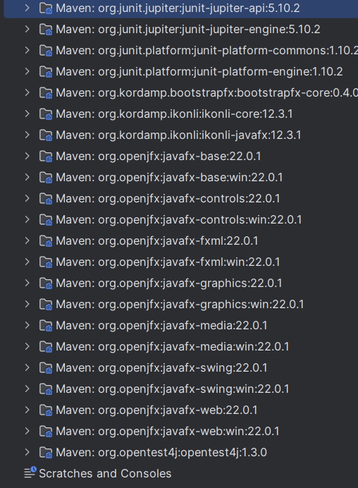

# MorseCodeConverter
MorseCodeConverter

## Description
Der Morse Übersetzer ist ein Programm, das mit JavaFX entwickelt wurde
und die Übersetzung zwischen dem deutschen Alphabet und Morsezeichen ermöglicht.
Die Hauptfunktion besteht darin, eingegebenen Text in das Morsealphabet umzuwandeln und umgekehrt,
Morsezeichen in Klartext zu dekodieren.

Das Programm richtet sich an alle, die sich für das Morsealphabet interessieren oder
es praktisch nutzen möchten, beispielsweise für Hobbyfunker oder Lernende.

Dank der intuitiven Benutzeroberfläche und der zuverlässigen Implementierung 
erfüllt der Morse Übersetzer seinen Zweck effizient und einfach.

Das ist alles was ihr an Klassen und jegliches benögtigt:

Dass ist mein Ergebnis von den Morse Übersetzer:

Video findet ihr hier:
https://youtu.be/w5TdDHtsOkY

Das braucht ihr nicht einfügen, denn das ist nur für die Screenshots die ich (Zizzy1YT)
nur für das Projekt gemacht habe.
